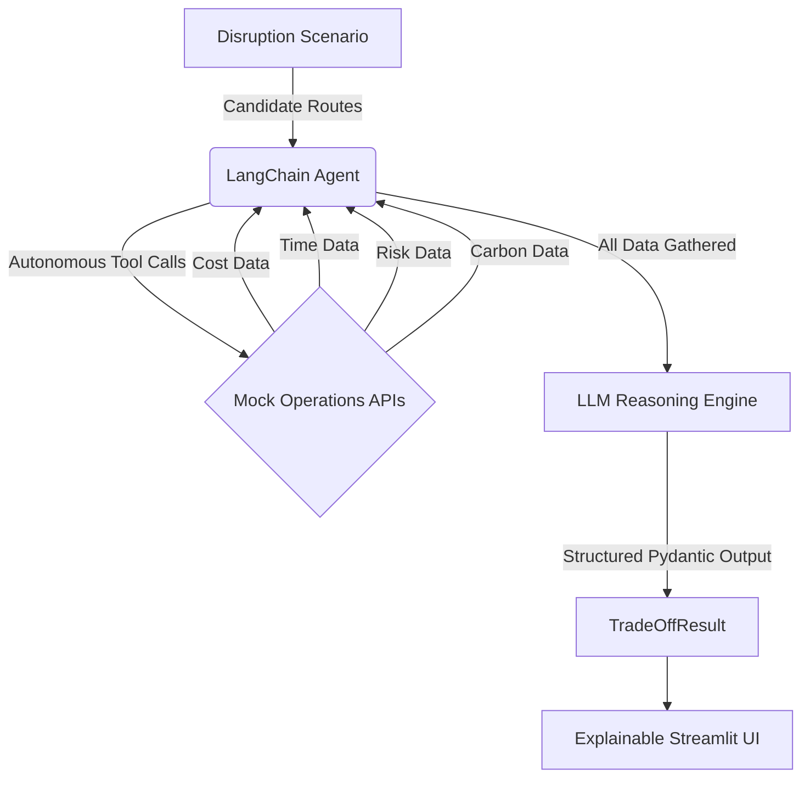

# AeroTrade XAI: Autonomous Supply Chain Orchestrator

**One-Line Pitch:** An autonomous AI agent that dynamically reroutes global supply chains during disruption events, fully backed by transparent, mathematically justified explainability.

## The Problem
Global supply chains are incredibly fragile. When a disruption hits—a port strike, a natural disaster, a sudden border closure—logistics teams scramble to find alternative routes. These decisions are high-stakes and involve complex trade-offs between cost, transit time, risk, and carbon emissions. However, delegating these decisions to AI introduces a "black box" problem. Without understanding *why* an AI chose a specific route and rejected others, human operators cannot trust its recommendations in mission-critical scenarios.

## What It Does
AeroTrade XAI is an end-to-end autonomous orchestrator that solves this problem. It allows users to:
1. Select a global disruption scenario (e.g., Port Strike in Singapore).
2. Adjust their organizational priorities via interactive weight sliders (Cost, Time, Risk, Carbon).
3. Deploy an autonomous LangChain agent to evaluate multiple candidate alternative routes.
4. Review the final recommendation through a fully transparent, highly explainable dashboard that visualizes the agent's live reasoning and decision logic.

## How the Agent Works
The core of AeroTrade XAI is powered by a LangChain autonomous agent integrated with deterministic operational tools. 

When a scenario is triggered, the agent receives a list of candidate routes. Without explicit human guidance, the agent enters an autonomous loop: it calls specific tools to compute the `cost`, `time`, `risk`, and `carbon` metrics for *each* route. Once it has gathered all the necessary data points, it synthesizes the findings and produces a structured, Pydantic-validated final decision containing the optimal route, a mathematical justification, and individual rejection reasons for every other alternative.



## How the Explainability Works
AeroTrade XAI was built specifically to solve the AI "black box" problem. Every UI feature is mapped to a specific transparency goal:

- **Live Agent Reasoning Timeline**: Solves the "what is it doing?" problem. Judges and operators can watch the agent call tools and process data in real-time, proving it isn't just generating a scripted response.
- **Color-Graded Trade-off Matrix**: Solves the "show me the math" problem. All routes are displayed with their raw metrics. The interactive sliders recompute the Penalty Score dynamically using pure math—not a hidden LLM call—proving the decision is grounded in quantifiable trade-offs.
- **"Why This, Not That" Rejection Panel**: Solves the "what about the alternatives?" problem. The LLM explicitly documents why every single rejected route lost out to the winner, providing closure and building trust.
- **Confidence Indicator & Executive Summary**: Solves the "bottom line" problem. A non-technical summary allows executives to grasp the recommendation and its confidence margin at a glance.

## Tech Stack
- **Python 3.11+**: The core language for modern data and AI applications.
- **Streamlit**: Chosen for its rapid, highly interactive data application capabilities, allowing us to build a beautiful, reactive UI for the agent trace and matrix.
- **LangChain**: The leading framework for agent orchestration. It handles the tool binding, the ReAct loop, and the structured output parsing.
- **Pydantic**: Critical for enforcing strict JSON schema structures on the LLM's output. Ensures the agent always returns valid, typed data that the UI can safely render.
- **OpenAI API (GPT-4o)**: State-of-the-art reasoning engine, highly capable at tool-calling and structured data extraction.
- **Pandas**: Used for formatting and dynamically sorting the Trade-off Matrix.

## Setup Instructions

1. **Clone the repository** (or download the files).
2. **Set up a virtual environment**:
   ```bash
   python -m venv venv
   source venv/bin/activate  # On Windows use: venv\Scripts\activate
   ```
3. **Install dependencies**:
   ```bash
   pip install -r requirements.txt
   ```
4. **Environment Variables**:
   - Copy `.env.example` to `.env`.
   - Add your `OPENAI_API_KEY` to the `.env` file.
5. **Run the application**:
   ```bash
   streamlit run app.py
   ```

## File Structure

| File | Description |
|------|-------------|
| `models.py` | Defines Pydantic models for structured agent outputs and internal state. |
| `scenarios.py` | Contains 3 hardcoded, realistic disruption scenarios and their candidate routes. |
| `tools.py` | Deterministic mock tool functions (cost, time, risk, carbon) bound to the LangChain agent. |
| `agent.py` | The LangChain agent orchestration loop, handling tool calls and structured decision output. |
| `ui_components.py` | Reusable Streamlit functions for rendering the timeline, matrix, and rejection panels. |
| `app.py` | The main Streamlit entry point, managing layout, state, and user interactions. |
| `requirements.txt` | Python dependencies. |
| `.env.example` | Template for required API keys. |

## Example Walkthrough
**Input**: The user selects the "Port Strike in Singapore" scenario.
- The agent is given 4 routes: Air Freight Direct, Sea-Air via Dubai, Rail via China-Europe, and Sea Freight via Cape.
- On the left panel, the agent streams its thought process, calling `get_route_cost` and other tools for each ID.
- The agent outputs a structured decision, picking "Sea-Air via Dubai" as the best balance.
- On the right panel, the matrix turns green for the chosen route.
- The user expands the "Why This, Not That" panel and sees: "Rejected Air Freight Direct: Cost was prohibitively high ($50,000+) despite fast transit."
- The user moves the "Cost" slider to 1.0, and the matrix instantly re-sorts to show "Sea Freight via Cape" as the new mathematical winner based purely on cost.

## Future Improvements
1. **Real-time API Integration**: Replace the mock tools with live logistics APIs (e.g., Project44, Flexport) to fetch real-world quotes and transit times.
2. **Multi-Agent Negotiation**: Deploy competing agents (e.g., a "Cost-Saver Agent" vs. a "Speed Agent") to debate the best route before presenting a compromised solution to the user.
3. **Live Disruption Feeds**: Integrate with global news/weather APIs to auto-generate scenarios rather than using hardcoded disruptions.
4. **Automated Booking Execution**: Add a final "Book Now" capability that pushes the chosen route via API into an ERP/TMS system (like SAP).

## Team / Credits
*Ishan Vaidya (25BCE1197) | Rishav Ghosh (25BCE1768)*
